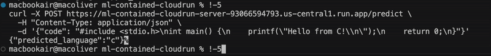

# ML-Contained-CloudRun

A fully containerized machine learning API deployed using **Google Cloud Run**.  
This project demonstrates **model serving**, **Docker** containerization, and **cloud deployment** best practices using **FastAPI** and **PyTorch**.

**Live Demo**  
Send a code snippet and receive a predicted programming language.  



---

## Technologies Used

- **FastAPI** for serving the API
- **Docker** for containerization
- **Google Cloud Run** for serverless deployment
- **PyTorch** for model inference
- **Pickle** for serialized vocab/encoder

---

## Cloud Run Endpoint

Replace the endpoint below with yours if needed.

```bash
https://ml-contained-cloudrun-server-93066594793.us-central1.run.app/predict

# Python
curl -X POST https://ml-contained-cloudrun-server-93066594793.us-central1.run.app/predict \
  -H "Content-Type: application/json" \
  -d '{"code": "def greet():\n    print(\"Hello World\")"}'

# Java
curl -X POST https://ml-contained-cloudrun-server-93066594793.us-central1.run.app/predict \
  -H "Content-Type: application/json" \
  -d '{"code": "import java.util.*;\npublic class Main {\n public static void main(String[] args) {\n System.out.println(\"Hello\"); } }"}'

# C
curl -X POST https://ml-contained-cloudrun-server-93066594793.us-central1.run.app/predict \
  -H "Content-Type: application/json" \
  -d '{"code": "#include <stdio.h>\nint main() {\n printf(\"Hello, World!\\n\"); return 0; }"}'

# C++
curl -X POST https://ml-contained-cloudrun-server-93066594793.us-central1.run.app/predict \
  -H "Content-Type: application/json" \
  -d '{"code": "#include <iostream>\nint main() {\n std::cout << \"Hello\" << std::endl; return 0; }"}'

# JavaScript
curl -X POST https://ml-contained-cloudrun-server-93066594793.us-central1.run.app/predict \
  -H "Content-Type: application/json" \
  -d '{"code": "function greet() {\n  console.log(\"Hello World\");\n}"}'
```

# Build image locally
docker build -t ml-api .

# Run locally
docker run -p 8080:8080 ml-api

# Test
curl -X POST http://localhost:8080/predict \
  -H "Content-Type: application/json" \
  -d '{"code": "def foo(): return 42"}'
